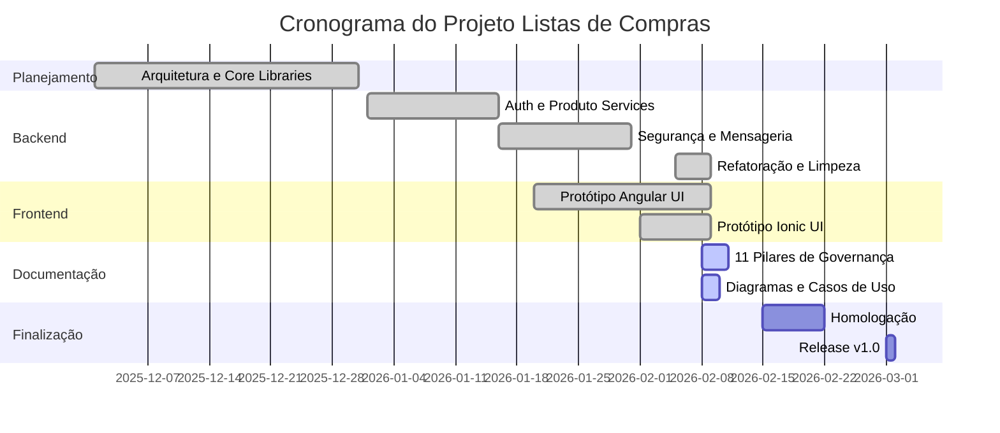
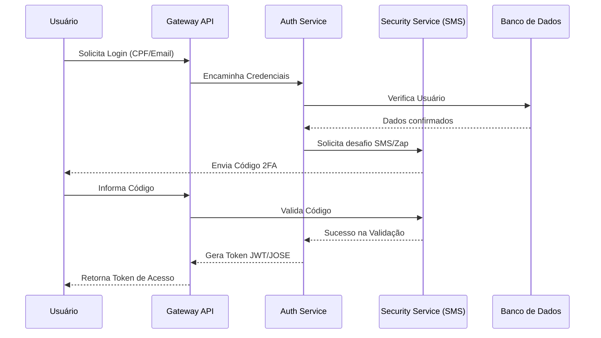
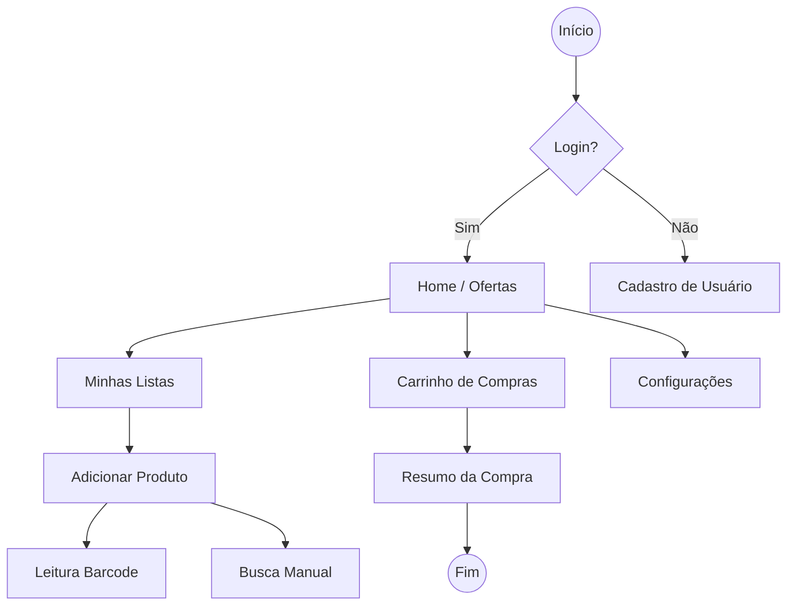

# 📘 Diagramas de Arquitetura e Cronograma

---

## 1. Mapa de Gantt (Cronograma Visual)

Este diagrama representa a linha do tempo das fases do projeto.

---

## 2. Diagrama de Sequência (Fluxo de Autenticação)

Representa a interação entre os componentes durante o processo de Login e Validação.

---

## 3. Fluxo Funcional (Navegação do App)

