# 📘 Diagramas de Arquitetura e Cronograma

---

## 1. Mapa de Gantt (Cronograma Visual)

Este diagrama representa a linha do tempo das fases do projeto.

```mermaid
gantt
    title Cronograma do Projeto Listas de Compras
    dateFormat  YYYY-MM-DD
    section Planejamento
    Arquitetura e Core Libraries :done, p1, 2025-12-01, 30d
    section Backend
    Auth e Produto Services      :done, b1, 2026-01-01, 15d
    Segurança e Mensageria       :done, b2, 2026-01-16, 15d
    Refatoração e Limpeza        :done, b3, 2026-02-05, 4d
    section Frontend
    Protótipo Angular UI         :done, f1, 2026-01-20, 20d
    Protótipo Ionic UI           :done, f2, 2026-02-01, 8d
    section Documentação
    11 Pilares de Governança     :active, d1, 2026-02-08, 3d
    Diagramas e Casos de Uso     :active, d2, 2026-02-08, 2d
    section Finalização
    Homologação                  : 2026-02-15, 7d
    Release v1.0                 : 2026-03-01, 1d
```

---

## 2. Diagrama de Sequência (Fluxo de Autenticação)

Representa a interação entre os componentes durante o processo de Login e Validação.

```mermaid
sequenceDiagram
    participant U as Usuário
    participant G as Gateway API
    participant A as Auth Service
    participant S as Security Service (SMS)
    participant D as Banco de Dados

    U->>G: Solicita Login (CPF/Email)
    G->>A: Encaminha Credenciais
    A->>D: Verifica Usuário
    D-->>A: Dados confirmados
    A->>S: Solicita desafio SMS/Zap
    S-->>U: Envia Código 2FA
    U->>G: Informa Código
    G->>S: Valida Código
    S-->>A: Sucesso na Validação
    A-->>G: Gera Token JWT/JOSE
    G-->>U: Retorna Token de Acesso
```

---

## 3. Fluxo Funcional (Navegação do App)

```mermaid
graph TD
    Start((Início)) --> Login{Login?}
    Login -- Sim --> Home[Home / Ofertas]
    Login -- Não --> Cadastro[Cadastro de Usuário]
    
    Home --> Listas[Minhas Listas]
    Home --> Carrinho[Carrinho de Compras]
    Home --> Perfil[Configurações]
    
    Listas --> AddItem[Adicionar Produto]
    AddItem --> Scan[Leitura Barcode]
    AddItem --> Manual[Busca Manual]
    
    Carrinho --> Checkout[Resumo da Compra]
    Checkout --> Finish((Fim))
```

